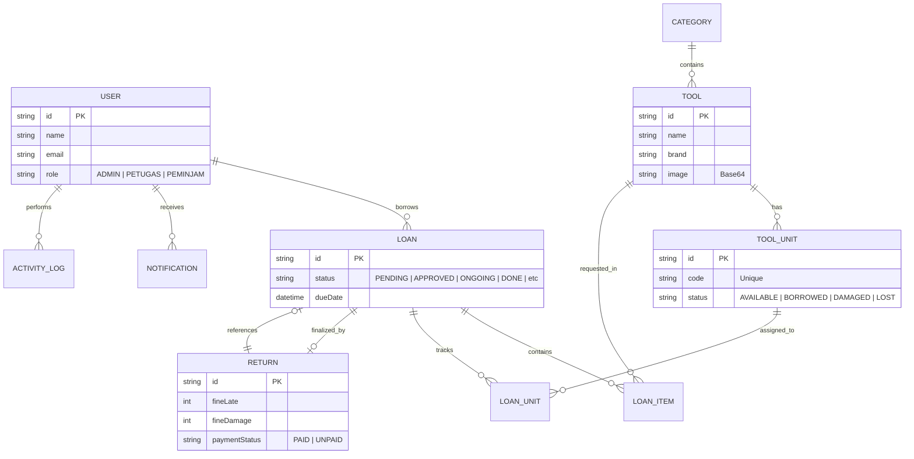
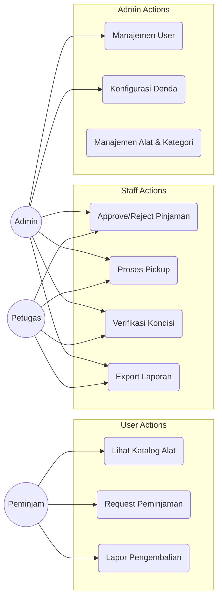

# ⚙️ SPK Tools — Sistem Peminjaman Alat

Sistem manajemen inventaris dan peminjaman alat untuk Lab/Bengkel. Direngkapi dengan alur kerja profesional mulai dari pengajuan, persetujuan, serah terima (pickup), hingga pengembalian dengan sistem denda otomatis dan pelacakan unit fisik.

## 🛠 Tech Stack

- **Framework**: Next.js 14 (App Router)
- **UI/Aesthetics**: Modern Industrial Emerald (Vanilla CSS + Bento Grids)
- **Database**: MySQL + Prisma ORM
- **Auth**: NextAuth.js v5
- **State Management**: React Query v5
- **Validation**: Zod
- **Export Engine**: ExcelJS

---

## 📐 Arsitektur Sistem

### 1. ERD (Entity Relationship Diagram)



### 2. Use Case Diagram



---

## 📋 Alur Kerja (Business Flow)

1. **Request**: Peminjam memilih beberapa alat dan menentukan durasi pinjam (**Status: PENDING**).
2. **Approval**: Petugas/Admin menyetujui jumlah unit yang boleh dipinjam (**Status: APPROVED**).
3. **Pickup**: Saat pengambilan barang, Petugas memilih unit fisik spesifik (berdasarkan Kode Unit) (**Status: ONGOING**).
4. **Return (Initiation)**: Peminjam melaporkan pengembalian dan kondisi awal barang melalui sistem.
5. **Inspection**: Petugas mengecek kondisi fisik. Sistem menghitung denda keterlambatan secara otomatis berdasarkan tanggal.
6. **Penalty (Optional)**: Jika ada kerusakan, Admin menentukan denda tambahan. Status menjadi **AWAITING_FINE** jika denda belum lunas.
7. **Closing**: Setelah semua beres, status menjadi **DONE** dan unit fisik kembali berstatus **AVAILABLE**.

---

## 🚀 Panduan Setup

### 1. Prasyarat

- Node.js versi 18.x atau terbaru.
- MySQL Database.

### 2. Konfigurasi Environment

Buat file `.env` di root direktori:

```env
DATABASE_URL="mysql://root:@localhost:3306/spk_tools"
AUTH_SECRET="buat-secret-random-disini"
NEXTAUTH_URL="http://localhost:3000"
```

### 3. Instalasi

```bash
# 1. Install dependencies
npm install

# 2. Setup Database (Push schema & Seeding)
npm run db:setup

# 4. Generate Prisma Client
npm run db:generate
```

### 4. Menjalankan Aplikasi

```bash
npm run dev
```

Akses di: `http://localhost:3000`

---

## 👤 Akun Akses Default

| Role         | Email             | Password |
| :----------- | :---------------- | :------- |
| **Admin**    | `admin@spk.com`   | `123456` |
| **Petugas**  | `petugas@spk.com` | `123456` |
| **Peminjam** | `rusel@spk.com`   | `123456` |

---

## 📊 Fitur Utama

- [x] **Modern Industrial UI**: Desain premium dengan Emerald theme.
- [x] **Direct Image Upload**: Simpan foto alat langsung sebagai Base64.
- [x] **Smart Fine System**: Denda telat otomatis & denda rusak manual.
- [x] **Granular Tracking**: Melacak status tiap unit fisik (Ready, Rusak, Hilang).
- [x] **Real-time Notifications**: Pemberitahuan status pinjaman & denda.
- [x] **Professional Reporting**: Export data pinjaman ke format Excel.
- [x] **Dedicated Routes**: Alur Create/Edit menggunakan halaman penuh (bukan pop-up).

---
